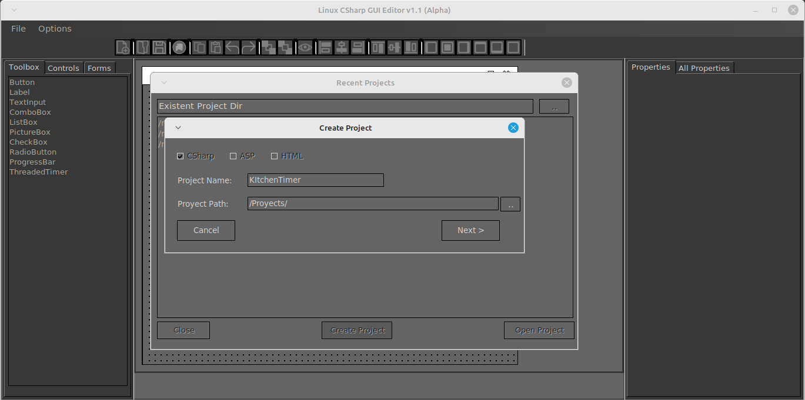
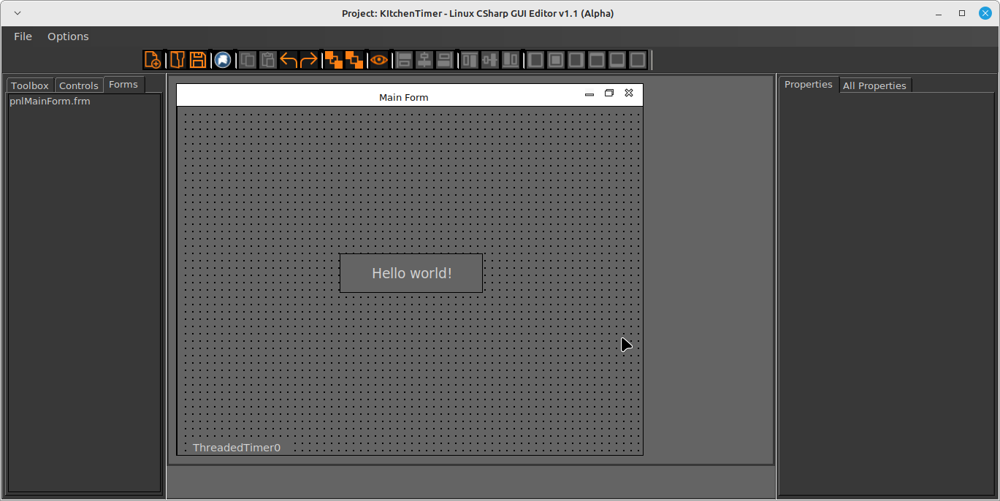
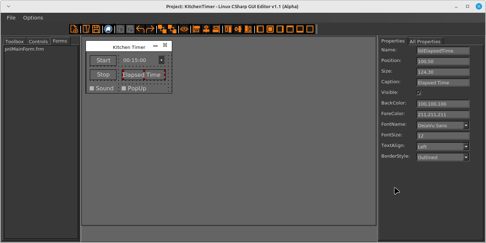
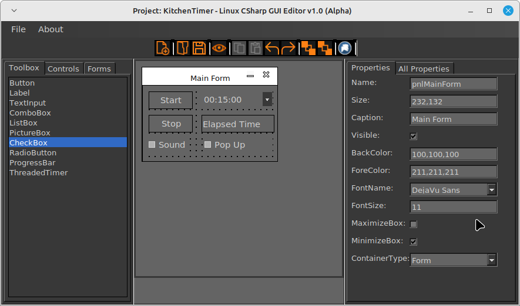
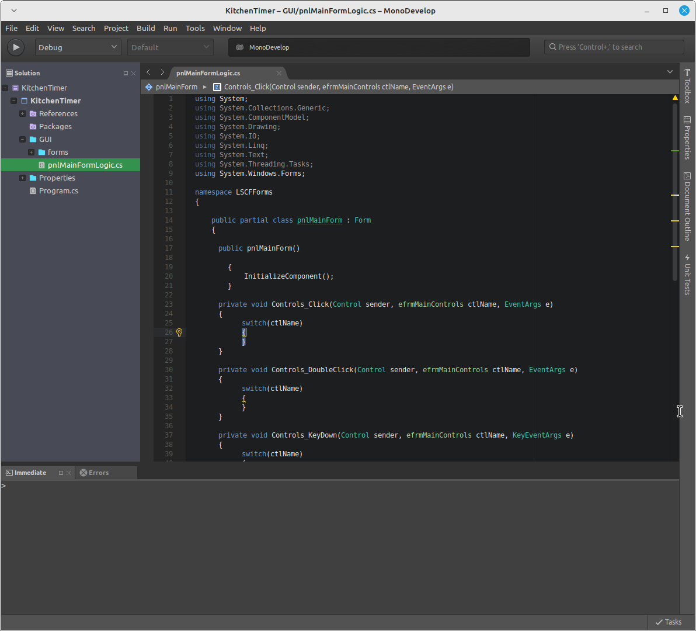

# Linux-GUI-Editor

## Overview

Yet another WSWYG GUI Editor for Linux Desktop apps.
The Editor is based in WinForms C#, to develop Linux  desktop apps in WinForms C#,
using MonoDevelop .net support for Linux.

Create the project -> Edit the GUI interface -> Click the Mono button on the toolbar -> start coding !

*note: the executable created in Linux can run on Windows also*

### Screenshots

#### Project creation:




####  Default project:



####  Editing:



####  Final result:




#### Mono project automatically generated (ready to code):




## Installation

### Debian / Ubuntu

apt get install monodevelop

download from the folder Releases  LCSF_Release_vX.X.Alpha.zip unzip the file 

bash: mono ./LCSF_Editor.exe

### Events code

```C#
private void Controls_Click(Control sender, efrmMainControls ctlName, EventArgs e)  
    {  
        switch(ctlName)  
        {  
	        case efrmMainControls.btn0:
		        btn0.Text = "Clicked";
	        break;
        }  
    }
}
```

### Bugs

*  The ListBox the HEIGHT can't be changed using drag , only using properties panel
* The preview writes the actual form so it's "save and preview"

### Open Source

will be .


